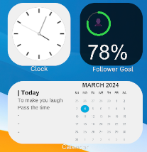

# Follower Goal

I propose you the code to inject in streamlabs OBS to display the twitch follower goal.

## How it works 

Go to [streamlabs.com](https://streamlabs.com/dashboard), in the `All modules` section.
Select `Follower Goal` > `Settings`. Enabled `Custom HTML/CSS`.

- For HTML: Copy the inside of the `body` tag in [followerGoal.html](src/followerGoal.html) file.
- For CSS: Copy the [styles.css](src/styles.css) file.
- For JS: Copy the [styles.css](src/script.js) file.

## Result

